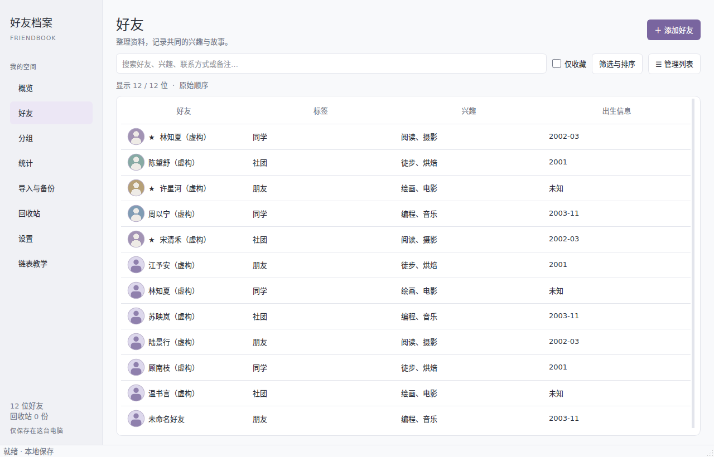
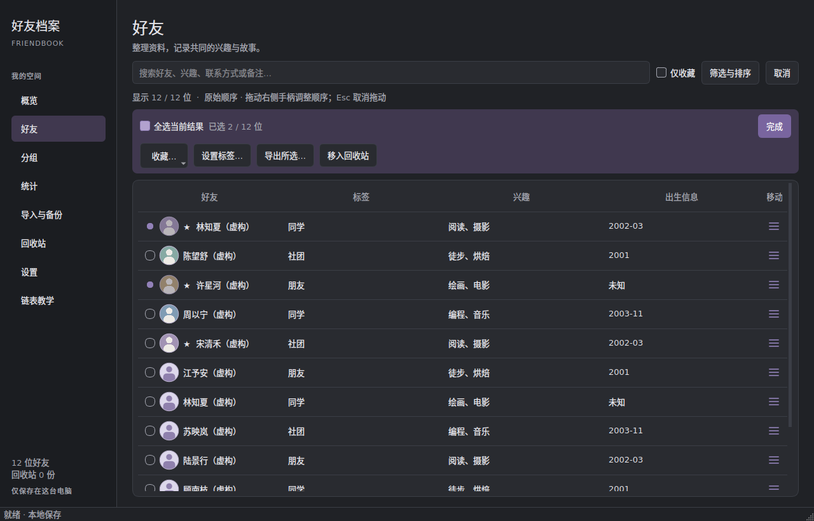

# 好友档案管理系统

Python / PySide6 本地桌面应用，使用自行实现的动态双向链表管理运行时档案，SQLite 负责事务持久化。无需账号、服务器或网络。

## 直接运行 Windows 成品

GitHub 仓库包含源码、测试、文档和虚构演示数据，不包含本机用户数据、虚拟环境及 `dist/` 构建产物。从 GitHub 下载源码后，请按下方“源码运行、测试和构建”操作；首次运行会自动创建 `data/` 保存自己的资料。

双击 **`dist\Friendbook\Friendbook.exe`**。必须保留同目录的 `_internal` 文件夹；复制给其他电脑时，复制整个 `Friendbook` 文件夹。

- 默认数据目录：项目根目录下的 `data\`。源码运行和项目内的 `dist\Friendbook\Friendbook.exe` 共用此目录，不随启动时的工作目录变化；重新打包不会覆盖它。
- 若将整个 `dist\Friendbook` 单独复制到其他位置，默认使用 exe 同级的 `data\`。需要带走资料时，关闭应用后另外复制项目的 `data\` 文件夹到该位置。
- `friends.sqlite3` 保存档案、照片、原始顺序和回收站；`settings.ini` 保存主题偏好。
- 首次启动为空。通过“导入与备份 → 导入 JSON”选择 `demo\虚构好友档案.json` 可导入 12 份虚构资料。
- 同一数据目录仅允许一个应用窗口。再次启动会提示目录被占用。
- 本地构建为 Windows x64 目录版，已在本机 Windows 实际启动验证；未签名，未在其他电脑或所有 Windows 版本上验证。

可指定独立的数据目录，用于课堂演示或恢复：

```powershell
.\dist\Friendbook\Friendbook.exe --data-dir "D:\FriendbookDemo"
```

## 使用

1. **录入**：点击“添加好友”，在右侧面板填写资料、联系方式、自定义属性和备注。所有个人资料均可留空，界面将显示“未命名好友”或“未知”。出生信息支持 `YYYY`、`YYYY-MM`，不补全未知月份或日期。
2. **资料与联系方式**：资料页的“更多资料”提供籍贯、现居地、学校 / 单位和职业，均可留空。联系方式按电话、QQ、微信、邮箱、其他分类，每类支持多项；一项不编号，多项显示电话1、电话2等。旧标签和内容原样保留；工作电话等有意义的旧名称仍可辨认，其他渠道支持自定义名称。自定义属性仍可自由增删。
3. **照片**：选择 JPEG、PNG、WebP 或 BMP；最大 15 MB、3000 万像素。自动转为最长边 1000 像素的 JPEG 并去除 EXIF，保存在数据库内，不依赖原图片路径。移除照片只影响该档案。
4. **分组与收藏**：在资料标签页填写分组并勾选收藏；好友页可勾选“仅收藏”。分组页面支持查看组内好友、重命名、合并到已有分组和解散分组（好友变为未分组，不删除档案）。新建空分组不单独持久化，保存归属于它的好友后分组即建立。
5. **组合搜索**：关键词按空格分开，全部词均需匹配；再与分组、精确标签、收藏条件取交集。搜索范围包括姓名、出生年月、兴趣、联系方式、标签、备注、自定义属性和分组。回收站搜索姓名与备注。
6. **排序与原始顺序**：点击“筛选与排序”展开分组、精确标签及排序条件。姓名、出生信息排序仅影响显示；空值最后，姓名按 Unicode 排列。详情面板的“更多”菜单提供前后添加和上下移动。只有未筛选、未勾选仅收藏且为原始顺序时可上下移动。筛选/排序下前后添加仍指所选好友在原始顺序中的真实位置，面板会说明。
7. **修改与删除**：首次进入好友页时列表占满可用宽度；点击好友后，详情从右侧滑出。点击“关闭详情”恢复全宽列表，双击或点击“编辑资料”切换为面板编辑。切换好友、页面、筛选、管理模式或关闭窗口时，对未保存草稿提供保存、放弃、取消三种选择；保存失败保留输入，操作不会继续。删除先进入回收站；还原放在原始顺序末尾。永久删除需要确认，不能撤销。
8. **重复与合并**：保存时提示同名或相同联系方式，允许独立保存。在详情“更多 → 检测重复 / 合并”中选择另一份档案，逐项选择冲突字段，再在右侧面板检查并保存草稿。当前 ID 和位置保留，另一份原始档案进入回收站。联系方式和自定义属性的冲突值采用附加名称同时保留；备注拼接、标签去重、收藏取并集。重复检测不保证识别格式不同的同一号码。
9. **概览与统计**：概览展示有效好友数、收藏数、本月已知生日及分组。统计提供年龄、兴趣、分组、生日月份图表，均附口径。出生信息缺失单独计数；仅知年份或生日月份不足以确定年龄段时，单列“年龄段不确定”。兴趣按常用分隔符拆分，同一好友相同兴趣去重。
10. **教学工具**：侧栏“链表教学”读取真实 `prev/next` 连接，包含完整 UUID 和头尾空指针，可结合添加、删除、移动前后观察。日常好友操作不要求理解链表。
11. **窗口与主题**：“设置”页面切换浅色/深色、打开数据文件夹或刷新数据。宽窗口可拖动列表与详情之间的分隔区；窄窗口在列表与详情间切换。编辑内容可滚动，底部保存操作始终保留。行高为 46 逻辑像素，整行悬停与选中反馈，不显示单个单元格焦点边框；点击有轻量波纹，页面 / 标签页 / 编辑面板即时切换，详情抽屉有缓动。设置中的“减少动态效果”关闭波纹及弹性动画并持久保存。系统原生文件对话框等不强行覆盖系统动效。快捷键：`Ctrl+N` 添加，`Ctrl+F` 搜索，`Ctrl+S` 保存草稿。
12. **管理列表**：点击搜索栏旁“管理列表”，勾选部分好友或“全选当前结果”，可批量加入 / 取消收藏、移至分组、导出所选或移入回收站。改变筛选 / 排序会清除勾选，避免误操作不可见对象。点击“完成”退出。键盘上下移动焦点、空格勾选、`Ctrl+A` 全选 / 取消全选。
13. **拖动原始顺序**：管理模式下，长按约 180 ms 或直接拖动行右端的三横杠。未勾选行移动自身；拖动已勾选行时，全部所选好友按原始相对顺序整体移动。边缘会自动滚动，插入线显示落点；`Esc` 或松手在列表外取消。筛选或临时排序下手柄禁用，重置后才可拖动。拖动只是视觉预览，松手后以一个事务保存，失败保留原顺序及勾选。

常用资料使用现有 `custom` 字段，分类联系方式仍保存为 `contacts` 键值对。schema 仍为 1，无数据库迁移；旧备份可读，新资料也随现有导入导出及完整备份保存。所选好友导出按链表原始相对顺序排列，包含照片、联系方式和全部自定义资料。

现有数据没有创建时间、更新时间或联系记录，因此不展示“最近添加”“最近更新”“最近联系人”。不需要迁移或重置现有档案。

保存、批量分组和导入导出等耗时操作由独立工作线程处理，界面显示处理状态并暂时禁用重复操作，提交成功后才更新内存与详情。初次打开数据库及大量列表/图表渲染仍有与数据规模相关的开销。

## 导入、导出与备份

- **导出全部有效档案**：JSON 包含所有有效档案、照片、自定义属性和链表顺序；不受当前筛选影响，不含回收站。
- **导入档案 JSON**：仅支持本应用 schema 1 格式。完整校验成功后一次提交；新 ID 依文件顺序追加到末尾。已存在于有效档案或回收站的 ID 跳过，既不覆盖也不复活。因此重复导入同一份文件不会新增重复 ID。同名但不同 ID 的资料仍独立保留。
- **完整备份**：包含有效档案、照片、自定义属性、顺序、回收站。不含主题偏好。
- **从备份恢复**：先验证文件，再自动生成 `恢复前备份-时间戳.json`，最后以一个事务替换当前数据。验证、备份或提交任一步失败均不替换内存档案。恢复前备份保存在数据目录，可以再次用于恢复。
- 文件为明文 JSON，数据库也未加密；备份中含个人资料，请放在自己控制的目录。应用不生成包含档案内容的日志，不向外发送资料。
- 完整数据上限为 100 MB，有效档案和回收站分别最多 50000 份；这是格式/容量防护，不代表已验证极限规模的交互性能。适合课程及个人档案，照片较多时完整快照保存会变慢。

## 故障处理

- 写入失败：表单保留，可修改或重试。检查磁盘空间、文件夹权限、杀毒软件占用；不要手工删除正在使用的数据库文件。
- 编辑冲突：先处理当前草稿，再在“设置 → 刷新磁盘数据”后重新打开档案编辑。本应用同时使用进程锁、数据库修订号和记录版本号防止静默覆盖。
- 程序异常退出：SQLite 未提交事务在下次打开时回滚。不要移动未关闭数据库的伴随 journal 文件。
- 数据库损坏：启动失败会保留原文件，不自动清空。关闭程序，复制整个数据目录留存，再使用 `--data-dir` 指定一个新目录启动，从 JSON 备份恢复。没有有效备份时不承诺能修复物理损坏的数据。

## 源码运行、测试和构建

建议 Python 3.11 x64。PySide6-Essentials 是官方 PySide6 基础模块分发，已包含本应用所用 QtCore、QtGui、QtWidgets，无需安装体积更大的 Addons。

```powershell
py -3.11 -m venv .venv
.\.venv\Scripts\python.exe -m pip install -r requirements-dev.txt
.\.venv\Scripts\python.exe main.py
.\.venv\Scripts\python.exe -m pytest -q
powershell -ExecutionPolicy Bypass -File .\build.ps1
```

若没有 `py`，将第一行替换为本机 Python 解释器的完整路径。`requirements-lock.txt` 记录交付时的实际构建版本，可用它重建同一依赖环境。

`build.ps1` 先运行测试，成功后调用 `Friendbook.spec` 创建目录版 exe，并复制说明和演示数据。开发和安装依赖需要网络；应用运行与 exe 使用无需网络。`--smoke-test` 为构建验证选项，启动窗口约 1.2 秒后正常退出，不导入演示数据。

## 课程要求对应

| 要求 | 模块 / 实现 |
| --- | --- |
| 自行实现动态双向链表 | `friendbook/linked.py`：`Node`、`LinkedBook`、头尾指针、ID→节点辅助索引 |
| 遍历、查找、插入、删除、修改、调整 | 链表 `__iter__ / get / insert / remove / update / move`；业务层搜索从头沿 `next` 遍历 |
| 实际运行时核心 | `Store.book` 为唯一有效档案集合；GUI 和业务从链表读取；新增、删除、编辑、合并、导入、恢复均修改候选链表 |
| SQLite 持久化与顺序恢复 | `friendbook/core.py`：带 revision 的单行状态快照；顺序由链表遍历产生，重启逐节点插入 |
| 资料验证、照片、备份、安全 | `friendbook/core.py`：格式验证、事务、原子文件替换、照片规范化、恢复前备份 |
| 本地桌面交互 | `friendbook/gui.py`：导航、好友工作区、草稿状态；`ui_widgets.py`：编辑器与主题；`ui_pages.py`：概览/统计/分组/工具；`ui_actions.py`：导入导出与合并；`ui_tasks.py`：后台业务任务；`ui_management.py`：批量管理；`ui_friend_list.py`：整行交互与拖动；`ui_motion.py`：可关闭动效；`ui_contacts.py` / `contact_fields.py`：联系方式分类与常用资料 |
| Windows 启动与打包 | `main.py`、`Friendbook.spec`、`build.ps1` |
| 自动化验证 | `tests/test_core.py`、`tests/test_safety.py`、`tests/test_gui.py`、`tests/test_paths.py`、`tests/test_overview.py`、`tests/test_management.py` |
| 虚构演示资料与界面检查 | `scripts/demo_data.py`、`scripts/visual_check.py`、`scripts/visual_interactions.py`、`demo/`、`docs/screenshots/` |

辅助容器职责与真实复杂度、事务协议见 [架构说明](docs/ARCHITECTURE.md)。验证范围见 [测试说明](docs/VALIDATION.md)。




