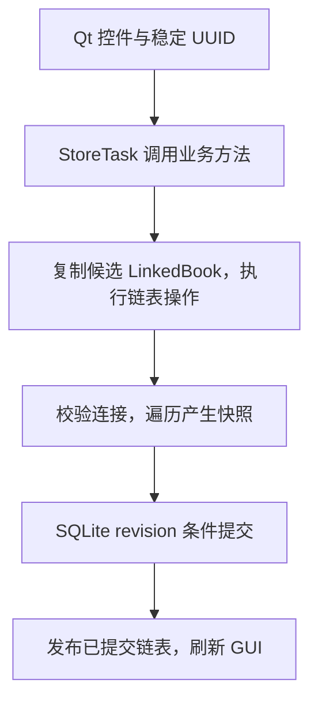

# 结构与复杂度

## 数据路径

保存期间旧链表仍是已提交状态；异常抛出前回滚 SQLite，候选对象丢弃。GUI 不提前修改当前节点，不做数据库检索来冒充链表查找。数据库事务提交后立即替换内存引用；若进程在提交后、替换引用前终止，下一次启动仍读取已经提交的新状态。

SQLite 使用默认回滚日志模式和 `synchronous=FULL`。进程锁负责通常的单实例访问，数据库修订号阻止绕过锁的其他连接静默覆盖，记录版本号阻止旧表单覆盖新记录。不把 `friends.sqlite3` 当作导出目标。

## 容器职责

- `Node.data` 持有有效档案。`prev/next` 和 `head/tail` 决定真实顺序。
- `LinkedBook.index` 是 ID→Node 字典，仅定位节点，不另外存放独立的有效档案副本或排序顺序。
- `Store.trash` 是已从有效链表移除的回收站档案字典，不替代有效档案链表。
- `ManagementSession` 独立拥有管理草稿的候选 `LinkedBook`、回收站与标签目录，不打开 SQLite。它不替代 `Store.book` 的已提交状态；取消直接丢弃，完成后经版本检查原子发布。
- `Store.label_catalog` 保存已创建的标签名，包括尚未分配好友的空标签，不包含好友对象或另一套好友顺序。
- GUI 的列表是一次显示缓存，来自链表遍历；临时排序只排序显示缓存。每行附带 UUID，任何操作通过 UUID 回到真实节点。
- JSON 数组是序列化和外部文件格式，不承担运行时管理。候选链表复制也逐节点执行，不通过 Python list 重建操作结果。
- 标签和联系方式等记录内部集合不是好友集合，使用普通容器。

## 真实成本

令 n 为有效档案数，t 为回收站数量，S 为总序列化数据大小，k 为筛选结果数，L 为检索文本总长度。

| 操作 | 链表 / 算法本身 | 应用端到端成本 |
| --- | --- | --- |
| ID 定位 | 字典平均 O(1)；最坏 O(n) | 只读定位平均 O(1) |
| 指定节点前后插入、删除、移动 | 平均 O(1) 定位与常数个指针修改 | 候选复制、完整性检查、完整快照写入 O(n+t+S) |
| 修改 | 平均 O(1) 定位，加档案校验成本 | O(n+t+S)，照片验证有解码成本 |
| 遍历 | O(n) | O(n) |
| 组合搜索 | 沿 next 遍历；按词匹配文本 | O(L × 关键词数量)，并包含字段展开成本 |
| 临时显示排序 | 对筛选缓存排序 | O(k log k)，字符串比较成本另计 |
| 重复检测 | 链表扫描姓名 / 联系方式 | 与全库姓名、联系方式总长度成正比 |
| 标签统计 | 链表遍历并累计每个标签归属 | O(n+a)，标签图表排序 O(g log g)；a 为标签归属总数，g 为标签数 |
| 导入、备份、恢复 | 验证与顺序遍历 | O(n+t+S+导入数据大小) |

空间：节点、索引和档案为 O(n+S)，事务候选及序列化快照还需 O(n+t+S) 临时空间。管理会话另持有一份候选状态及原始快照，仍为同阶额外空间。为了适度分层和可审计事务，本项目有意采用完整快照；不声称一次 GUI 保存总体 O(1)。事务与文件操作放在后台线程，每次任务在该线程建立并关闭自己的 SQLite 连接，仍不使用增量数据库更新。管理草稿的复制、校验、变更与界面预览在主线程执行，规模大时仍有开销。

上表的 ID 定位指链表 `get`。GUI 使用的 `Store.record` 另做单份档案深拷贝，其总体成本还包含该档案内容大小；`records` 也会复制匹配结果。每次后台任务重新加载已持久化数据，因此有一次额外的 O(n+t+S) 读取与验证，避免跨线程共享 SQLite 连接。

## GUI 升级的职责边界

- `gui.py` 管理导航、好友列表、稳定 ID 选择、草稿与异步任务状态；`ui_widgets.py` 提供统一主题、详情组件和内嵌编辑器。
- `ui_pages.py` 通过 `Store.overview / group_counts / connection_rows` 构建其他页面；`ui_actions.py` 保留人工合并、导入导出、备份恢复的交互入口。概览生日和收藏卡片打开查询名单，名单通过 UUID 打开好友详情；资料没有具体生日日期，生日入口按已知月份统计。
- GUI 不访问 `book.index`、节点指针或数据库连接。查询通过 `Store.records / record` 获取用于显示的深拷贝；实际有效好友集合仍为双向链表。
- `StoreTask` 不操作任何 QWidget。任务内加载并校验数据库修订号，调用现有 Store 事务方法，关闭连接后将已提交的链表快照交给主线程。主线程通过 `Store.adopt` 发布，界面成功提示只在此后出现。工作线程没有共享 SQLite 连接，失败时不会提前发布候选状态。
- 单个窗口同时只允许一个业务任务。保存中的窗口关闭会被阻止，避免销毁运行中的线程。记录版本与数据库 revision 保持原有乐观冲突保护。
- 导入预览先验证文件，确认后提交的就是该份已验证记录缓冲；文件若在确认期间发生变化，不会被重新读取成另一批未经预览的资料。
- 临时排序仍仅改变显示缓存。筛选/页面/好友切换由同一个草稿保护入口处理；选择“保存并继续”会等保存成功，失败则保留原页面和全部输入。
- 宽窗口使用可拖动分隔条；窄窗口改为列表/详情切换。编辑器各页可滚动，保存按钮不随表单内容滚出视口。
- 统计不修改原始档案，也不新增时间戳字段。年龄以可能区间划分，仅区间整体落入某一档时计入，否则单列不确定；无年份单列未知。
- `ui_charts.py` 使用同一份统计数据绘制竖向柱状图、环形图和比例图例。标签按每位好友的各个标签分别计数，未标记者独立计数；比例分母是图中标签归属次数之和，不是去重好友数。首次显示各图表类型时播放入场动画，重复访问不重播，减少动态效果时直接呈现最终状态；这不恢复通用页面切换过渡。

## 标签与旧数据兼容

- schema 仍为 1，记录允许新增可选 `labels` 数组，快照允许新增 `label_catalog`。缺少新字段的旧文件仍通过校验，原 `group` 非空时作为一个标签读取；明确修改标签后 `group` 投影为第一个标签，清空标签同时清空 `group`。
- 原 `tags` 数组不被当作新分类标签，也不丢弃：编辑器和详情把它称为“备注”。原 `notes` 字符串称为“详细备注”，保持原内容和独立编辑区。
- `labels.py` 统一标签规范化、去重与旧字段兼容，`ui_labels.py` 提供可检索的多选与新建入口。独立“新建标签”写入目录，即使还没有好友使用也会保存。好友编辑中新建的标签与资料一起保存，管理模式中新建的标签随会话一起提交或放弃。
- 搜索、筛选、计数、重命名与删除均按多标签归属处理。重命名到已有标签时去重，其它标签不变；删除某个标签不删除好友。标签目录随导入、导出、备份和恢复保存，空标签也可以往返。

## 保存与恢复边界

### 列表管理与交互扩展

- `ListManagement` 维护可见结果的 UUID 勾选集及一个 `ManagementSession`。批量收藏、标签、删除与松手后的排序只修改候选链表，显示读取 `friend_source()`；`Store.book` 和磁盘保持原样。改变筛选清除勾选，但不丢弃已经暂存的修改。
- “完成”经 `StoreTask` 调用 `Store.commit_management(payload, base_revision)`，校验完整候选与会话开始时的修订号，一次事务保存全部修改。失败保留管理草稿、顺序和勾选；外部连接已写入时拒绝覆盖。“取消”丢弃整个会话，不写数据库，确认框的“知道，以后不再提示”在确认放弃后才写入 `QSettings`。
- 搜索栏的管理按钮进入后变为“取消”，一直保留。`ui_expand.AnimatedExpansion` 只动画工具栏高度，由原布局连续推动列表。离开好友页、添加、刷新或关闭窗口时，独立管理保护入口提供保存并继续、放弃、继续管理；保存成功后才继续目标动作。
- 所选导出使用管理草稿的已校验快照并在后台原子写文件，不提交数据库。它是用户明确发起的外部文件操作；取消管理不会删除已经导出的文件。
- `FriendsTable` 只画勾选状态、整行悬停、波纹、拖动浮层与落点空隙，动画不修改业务节点。邻行以弹性位移让位或回位；松手发出所选 UUID 与落点锚点，管理草稿从真实链表提取所选 ID 顺序，再逐个执行链表 `move`。临时 ID 命令缓冲不是有效好友容器。仅管理模式显示手柄并响应自由拖动，而且须无筛选、按原始顺序显示。
- 多选重排的链表扫描及移动 O(n+k)，k 为所选数；每次暂存仍包含候选复制、校验和刷新 O(n+t+S)。拖动帧只更新视觉落点，松手暂存，整个管理会话“完成”时才写一次磁盘；不声称批量持久化 O(1)。
- `contact_fields` 与 `ui_contacts` 是呈现适配层。电话、QQ、微信、邮箱分组仍映射到原 `contacts` 字典；已有键和值在未编辑时保持不变，新增键先避让全部已有键。籍贯等常用字段保存在原 `custom`，不引入 schema 迁移。重复检测、合并、搜索、导入导出和备份仍通过原记录字段工作。
- `ui_motion` 只维护点击波纹、抽屉缓动等瞬时视觉状态，动画不触发业务提交、不阻塞输入，设置可关闭动效。导航、标签页和编辑面板使用 Qt 原生容器即时切换，不捕获页面快照或播放切换过渡。好友、分组等表格委托绘制时去掉单元格焦点框，保留键盘焦点及整行选中反馈。详情右上角星形按钮更新收藏，编辑器不重复放收藏开关。抽屉布局在窄窗口改为单面板，拖动分隔区调整桌面详情宽度。系统原生对话框遵从平台行为。

- 图片作为 JPEG 的 Base64 文本与档案放在同一个 SQLite 事务内，不存在数据库写成功而图片文件复制失败的两阶段问题。
- 导出先写同目录临时文件，flush/fsync 后 `os.replace` 替换；失败保留旧目标并清理临时文件。
- 恢复先完整验证，再创建恢复前备份；只有备份完成后才允许数据库事务替换。
- 导入保留原 ID，不覆盖重复 ID（包括回收站），不自动合并同名档案。JSON 重复字段拒绝导入，避免解析时悄悄覆盖。
- SQLite 提供事务级异常退出恢复；这不等于防止硬件损坏、文件被外部手动篡改或所有存储设备在断电时丢数据。使用可读备份应对这些情况。
- schema 固定为 1，不接受未来版本；兼容读取旧字段，并校验新增标签字段和目录，不自动重置或清空旧数据。

## 人工合并

首先从链表读取疑似重复候选。保留 ID 和节点位置由用户当前选中的档案决定；冲突的姓名、年月、兴趣、照片逐项选择。标签合并去重；不同联系方式和自定义属性均保留，重名字段添加“（合入）”。用户还需检查编辑草稿并点击保存才会提交。同一事务中更新保留节点、删除来源节点并保存来源原始档案到回收站。取消或失败时两份有效档案不变。
